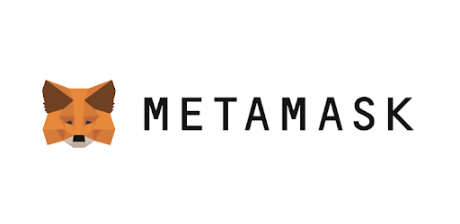

<header>
  <a href="https://rarepress.org">Home</a>
  <a href="https://twitter.com/skogard">Twitter</a>
  <a href="https://github.com/rarepress">GitHub</a>
  <a href="https://discord.gg/BZtp5F6QQM">Discord</a>
</header>

> Legacy v0 endpoint docs: https://docs.rarepress.org
>
> Examples and tutorials: https://examples.rarepress.org
>
> API reference: https://api.rarepress.org
>
> Rarepress OS documentation: https://os.rarepress.org


# Rarenet

## Rarepress over HTTP

Rarenet is a web server that exposes [Rarepress OS API](https://os.rarepress.org) over HTTP RPC calls.


Once you start running a Rarepress node, others can store and manage their NFTs using your Rarepress by connecting to it over HTTP.

1. `rareterm`: Connect to a Rarenet node from the browser.
2. `rareterm.node`: Connect to a Rarenet node from node.js.

## Why Rarenet?

### Decentralized Offchain NFT Network

Rarepress can function as a building block for a **decentralized and unbounded Internet of NFTs, with no scaling limits**.

To build such a network, we need the underlying tokens (NFTs) to have the following qualities:

- **Low cost:** the cost to mint should be as low as possible. preferablly free to create.
- **Decentralized:** the tokens can be stored and routed in a decentralized manner
- **Private:** the traffic should allow for both public and private communications.
- **No single source of failure:** Each creator has full, autonomous control over their own data and the node in the network.
- **Censorship resistant:** Just like the Internet, which passes around data packets without worrying about censorship, we need to be able to pass around and route NFTs among multiple parties without worrying about censorship, even when the communications are private.

And Rarepress builds on top of a decentralized NFT protocol that natively facilitates this feature, also known as "Lazy minting" ([Rarible NFT protocol](https://rarible.org)).

Rarepress lets you use these lazy minted NFTs as data packets.


### Lazy Minted NFTs as Packet

Minting NFTs normally costs a lot of money.

Even when you use L2 solutions (Rarepress will also support L2 solutions) the cost is still not negligible when you start thinking about tokenizing a lot of things (like millions of digital assets that may or may not be claimed or traded).

**Lazy minting,** is a new approach that solves this problem by allowing you to mint NFTs without immediately posting to the blockhain. This means you can **mint as many NFTs as you want for FREE,** and the payment is made only when someone purchases the token.

This is powerful because:

1. **Zero barrier Onboarding:** Anyone can start minting and deploying NFTs without ever owning Ether. They can earn Ether by minting and selling their NFTs.
2. **Hyper Scalable:** 100% FREE Minting means you don't have to worry about what to tokenize and what not to tokenize. You simply tokenize everything you think **might be of value**, and let the assets prove its value on the market. This means you can mint millions and billions of tokens without worrying about the cost.

### Centralization Problem


But there is a problem. Because these NFTs are not immediately stored on the blockchain, the entire NFT ecosystem becomes centralized around a small number of offchain token silos, which defeats the purpose of using the blockchain and causes a lot of other problems.

In fact, most developers trying to build NFT-powered applications nowadays end up relying on permissioned and centralized APIs in order to manage their own tokens.


This is problematic because:

1. **Not scalable:** NFT can be the packet that will potentially power the entire "next Internet". Everything from collectibles to supply chain items to continuous data stream will be tokenized. It does not make economic sense for a single centralized organization to be responsible for hosting and maintaining each and every token. **Instead of building AOL or Compuserve, we need to build the Internet of NFTs.**
2. **Single point of failure:** If everyone uses a single host for storing all their tokens, it becomes the single point of failure. Lazy minted tokens can be easily censored or hacked.
3. **Reliance on a trusted 3rd party:** Developers and businesses who are thinking about building NFT-powered applications probably don't want to keep hitting someone else's API to serve their own customers. They will want to own their own tokens and their own user experiences.
4. **No privacy:** When developers rely on 3rd parties instead of hosting and managing their own token database, it's impossible to "lazy mint" tokens without making them public. This is hugely limiting because every NFT needs to be immediately public. There are many powerful things you can do when you have private NFTs.
5. **Censorable:** Lazy minted tokens stored on centralized walled gardens can be censored, and users can be censored from minting their tokens on certain platforms.

These problems are critical, and are some of the main reasons why one may decide not to adopt lazy minted tokens, they would rather opt for tokens that are minted immediately on the blockchain and try to avoid reliance on a 3rd party.

But this limits the potential use cases for NFTs because the tokenization cost is too high if you're trying to tokenize a lot of things (even when using L2s), not to mention that **onchain-only tokens** limit us to "public only" token use cases.

It would be great if there was a way to use lazy minted NFTs as much as we can, but without the centralization problem.


### Solution

#### Peer to Peer NFT


Rarepress was designed with this centralization problem in mind.

Because every NFT creator can run their own autonomous NFT operating system, the NFT creators can directly communicate with each other in a similar manner to how emails work.

Rarepress achieves this by taking advantage of the following technologies:

1. [Rarible Protocol](https://rarible.org)'s own smart contract based lazy minted tokens 
2. [IPFS](https://ipfs.io/)'s content addressable file system's hash based IDs

How are these technologies used?

- **IPFS-powered decentralized Offchain Tokens:** Lazy minted tokens (tokens not yet settled on the blockchain) are stored on an IPFS-compatible storage, which can be selectively published to the IPFS network.
- **Blockchain-powered onchain Tokens:** Once a lazy minted token is traded for the first time, it is recorded on the blockchain.

By combining both the onchain and the offchain approaches, Rarepress can act as an operating system for decentralized NFTs, which:

1. have **no scaling limits**
2. have **no single point of failure**
3. is **censorship reistant**
3. lets creators and businesses **host and control their own NFT infrastructure and data**
4. can be communicated in a **Peer to Peer** manner
5. can be **private**

#### Like email, but for Tokens

The `"rarenet"` is a network that works similar to how emails work. Email servers are decentralized and anyone can run them. And the messages are passed back and forth in a peer to peer manner. 

Rarenet is like this, but for Tokens:

1. **Sending:** Using `rareterm` or `rareterm.node` (thin clients), or `rarepress` (directly using the OS), your app can post your tokens to other applications that expose `rarenet` endpoints.
2. **Receiving:** By running your own `rarenet` you can also allow other applications to post their tokens to your app.

Note that this is a different way of looking at NFTs.

In Rarepress/Rarenet world, "NFTs" are not just collectibles and art. **They are low level data packets that make up the decentralized internet.**

#### Decentralized Authenticated Communication over NFTs

We have compared Rarepress to emails. But compared to the email network, Rarenet is:

1. **More Decentralized:** It does not require a centralized authentication system. Authentication is decentralized using each user's wallet signature. Therefore there is no lockin effect.
2. **Anti-spoofing:** Messages cannot be spoofed because every token needs to have a valid signature in order to be accepted by a Rarenet node.
3. **Deterministic Peer to Peer Applications:** Because the tokens cannot be spoofed, we can utilize the NFTs as data packets, and because we can trust cryptography, we can use the NFT data packets as events that trigger certain actions on remote machines. Something like this has been difficult to implement at scale because of the security issues. But with cryptography, and the data encapsulation scheme providded by the underlying [NFT protocol](https://rarible.org) it all becomes possible.
4. **Portable:** Because each user's identity is NOT issued by a centralized email provider authority but comes from each user's wallet, the NFT data packets can be replicated in a decentralized manner. In the network diagram above, we can imagine one NFT being replicated to multiple nodes in the network, so they can be used for different purposes.


---

# How it works

## Server-Client Architecture

Rarenet is an HTTP server that:

- Hosts a rarepress OS
- Provides HTTP-powered RPC access to thin clients

If you want to implement a system where multiple clients write to and read from a single backend, you can use Rarenet.

### Server

You can run a Rarenet server as your token backend.

> Learn more:
> 
> ["running your own rarenet"](#running-your-own-rarenet)


### Client

There are 2 thin clients you can use to communicate with a Rarenet server:

1. `rareterm`: Browser version, lets users sign with their browser wallets such as MetaMask.
2. `rareterm.node`: Node.js version. Ships with a built-in wallet and lets users sign with the built-in wallet.


#### Browser

> Learn more:
>
> ["Remote minting in the browser"](#remote-minting-in-the-browser)


#### Node.js

> Learn more:
>
> ["Remote minting over HTTP"](#remote-minting-over-http)


## Rarepress vs. Rarenet

So when should you use what?

- **Use rarepress directly if:** you're using rarepress for your own NFT project (and not providing a service for others), and only need YOUR OWN Signature for dealing with NFTs.
- **Use rarenet if:** you are building a service or an API using Rarepress and need multiple user signatures WITHOUT storing their keys on your rarepress. If you have multiple users, you will need to let them sign messages with their own wallets, therefore you can't use rarepress directly (you can't host your users' wallets on your rarepress for security reasons). rareterm lets users use their own wallets to sign messages and submit to your rarenet RPC endpoint, which hosts a rarepress operating system.


Note that Rarepress and Rareterm have an isomorphic API, which means you can use the same JavaScript API that works both locally and remotely.

The only difference between the two is the **initialization step.**


---

# Demo

Let's start by trying out a demo.


In this example, we will start by connecting to an existing public `rarenet` node with `rareterm` (in the browser).

## How it works

We have a purely frontend web app which uses a public rarenet node (https://eth.rarenet.app/v1) as its backend. The entire app fits into a single JSFiddle (We will also learn how to run your own Rarenet node later)

This demo is a web app that uses randomly generated art from https://thisartworkdoesnotexist.com/ and lets you tokenize them as NFTs.

How it works: Click the "refresh" button to get the art you like, and press "mint" to mint it as NFT. That's all!


> NOTE
>
> This example utilizes [rareterm](#rareterm) in order to remotely mint tokens from the browser.

## Try yourself

To try it out, click the "Result" tab and click "Mint" button from the JSFiddle below. Before you try it out, make sure you have Metamask installed (https://metamask.io).


<iframe width="100%" height="600" src="//jsfiddle.net/skogard/jnhw6x0b/9/embedded/html,result/" allowfullscreen="allowfullscreen" allowpaymentrequest frameborder="0"></iframe>

---

# Quickstart

There are 2 ways you can interact with Rarenet:

- **Browser:** Connect to a remote rarepress (a `rarenet` node) from the browser using `rareterm`.
- **Node.js:** Connect to a remote rarepress (a `rarenet` node) from a node.js application using `rareterm.node`.

We will first learn how to use `rareterm.node` to mint tokens in node.js. Then we will apply the same code in the browser using `rareterm`.

## Remote Minting over HTTP

This example works exactly the same as the [Rarepress OS Quickstart example](https://os.rarepress.org/#/?id=quickstart), but instead using `rareterm.node`.

The only difference is, the Rarepress OS example stores everything on its own machine, whereas this example stores everything on the remote rarenet node.

Let's first create a project:

```
mkdir remote-nft
cd remote-nft
npm init
```

Install `rareterm.node`:

```
npm install rareterm.node
```

Now let's write the code. Rarepress has an isomorphic API system for all of the modules `rarepress`, `rareterm`, and `rareterm.node`, so the code below is pretty much the same as the [Rarepress OS Quickstart example](https://os.rarepress.org/#/?id=quickstart), **except the initialization step.**

We are going to connect to a public rarenet node at `https://eth.rarenet.app/v1`.

```javascript
const Rareterm = require('rareterm.node');
(async () => {
  // 1. initialize
  const rarepress = new Rareterm()
  await rarepress.init({ host: "https://eth.rarenet.app/v1" });
  // 2. import a web image to fs
  let cid = await rarepress.fs.add("https://thisartworkdoesnotexist.com")
  // 3. create a token and save to local rarepress, referencing the image
  let signedToken = await rarepress.token.create({
    type: "ERC721",
    metadata: {
      name: "😎",
      description: "sunglasses",
      image: "/ipfs/" + cid
    },
  })
  console.log("signedToken", signedToken)

  // 4. publish the image file to IPFS
  await rarepress.fs.push(cid)
  // 5. publish the metadata file to IPFS
  await rarepress.fs.push(signedToken.tokenURI)

  // 6. publish the signed token to rarible
  let sent = await rarepress.token.send(signedToken)
  console.log("# SENT", sent)
  console.log(`Check your token at: https://rarible.com/token/${sent.id}`)

  // 7. Exit the program
  process.exit()
})();
```

Note that the only part different from the `rarepress` example is the initialization step:

```javascript
const Rareterm = require('rareterm.node');
(async () => {
  // 1. initialize
  const rarepress = new Rareterm()
  await rarepress.init({ host: "https://eth.rarenet.app/v1" });
  ...
```

1. It requires `rareterm.node` instead of `rarepress`
2. When you run `const rarepress = new Rareterm()`, it gives you a `rarepress` RPC session, which now has the identical API as the `rarepress` module.
3. It initializes by passing a `rarenet` URL as `host` attribute: `https://eth.rarenet.app/v1`

It should work exactly the same as the `rarepress` example.

The only difference is that:

1. The tokens are being stored on the `rarenet` side (on https://eth.rarenet.app)
2. The `rareterm.node` app is only acting as a thin client
3. You can provide `rarenet` as a service and allow multiple users to plug into your `rarepress` to manage their NFTs.

## Remote Minting in the browser

Finally, lets try minting tokens from the browser. For browser use cases we use the `rareterm` package.

`rareterm` in the browser works the same as `rareterm.node` with a few differences:

1. It works in the browser (not as a module embedded in an application)
2. It uses whichever wallet is installed on the browser (such as MetaMask) instead of using a built-in wallet like `rareterm.node`.
3. Because it uses the browser wallet, there is a limitation that every signature must be approved manually by the users. (with `rareterm.node` you can create a loop and mint thousands of tokens without asking for manual approval since you have direct access to the built-in wallet).

Before we go in, let's make sure you have a wallet installed on the browser.

This tutorial assumes that you have already installed [Metmask wallet](https://metamask.io/). If you haven't, go install it first.



That's about all you need before getting started. Everything will happen in the frontend so You only need a web browser.

Let's now try building the exact same app as the `rareterm.node` example, but using `rareterm`. Let's first create a project:

```
mkdir browser-nft
cd browser-nft
```

We are going to connect to the same public rarenet node at `https://eth.rarenet.app/v1` for this demo.

Create an `index.html` file:


```html
<html>
<body>
<button id='mint'>mint</button>
<a id='market' target="_blank"></a>
<script src="https://unpkg.com/rareterm"></script>
<script>
const rarepress = new Rareterm()
document.querySelector("#mint").addEventListener("click", async (e) => {
  // 1. initialize
  await rarepress.init({ host: "https://eth.rarenet.app/v1" });
  // 2. import a web image to fs
  let cid = await rarepress.fs.add("https://thisartworkdoesnotexist.com")
  // 3. create a token and save to local rarepress, referencing the image
  let signedToken = await rarepress.token.create({
    type: "ERC721",
    metadata: {
      name: "😎",
      description: "sunglasses",
      image: "/ipfs/" + cid
    },
  })
  console.log("signedToken", signedToken)

  // 4. publish the image file to IPFS
  await rarepress.fs.push(cid)
  // 5. publish the metadata file to IPFS
  await rarepress.fs.push(signedToken.tokenURI)

  // 6. publish the signed token to rarible
  let sent = await rarepress.token.send(signedToken)
  console.log("# SENT", sent)

  // 7. Update the "a" tag to point to the marketplace link
  console.log(`Check your token at: https://rarible.com/token/${sent.id}`)
  document.querySelector("#market").setAttribute("href", `https://rarible.com/token/${sent.id}`)
  document.querySelector("#market").innerHTML = "visit rarible"

})
</script>
</body>
</html>
```

Note that the it's the same code as the `rarepress.node` example. The only difference is:

1. it has a `mint` button, which when clicked triggers the mint action
2. you include the `https://unpkg.com/rareterm` as `<script>` tag instead of requiring.
3. in addition to `console.log()` to view the URL, it sets the `<a>` tag's url to the marketplace url.

Now let's start a local web server using the [http-server](https://github.com/http-party/http-server) module:

```
npx http-server
```

it will start a local HTTP server and print something like this:

```
Starting up http-server, serving ./
Available on:
  http://127.0.0.1:8081
  http://192.168.1.48:8081
  http://169.254.12.15:8081
```

Open http://127.0.0.1:8081 and you will see a web page with a single "mint" button.

When you click it, it will pop up a MetaMask wallet, and when you approve the signature, it will create the token. Wait a bit after the metamask signature, and once it's successfully minted it will display a link to the rarible marketplace where you will see the token listed there.

## Public rarenet nodes

So far we have used a public rarenet node at https://eth.rarenet.app/v1

This is a public rarenet node for minting on the Ethereum mainnet. There are also other public rarenet instances for hosting testnet tokens, so feel free to use those too:

- **mainnet:** https://eth.rarenet.app/v1
- **rinkeby:** https://rinkeby.rarenet.app/v1
- **ropsten:** https://ropsten.rarenet.app/v1

## Running your own rarenet

Now that we know how to use `rareterm` and `rareterm.node` to interface with a public `rarenet` node, now it's time to try running your own. It's very easy!


### 1. Clone rarenet

```
git clone https://github.com/rarepress/rarenet.git

```

### 2. Install dependencies

```
cd rarenet && npm install
```

### 3. Start the node

```
npm start
```

And that's it!

your rarenet server will be running at http://localhost:5000/v1.

### 4. Replace the rarenet host URL with your own

Now go back to the quickstart examples from the [rareterm](#remote-minting-in-the-browser) and [rareterm.node](#remote-minting-over-http) sections above, and switch out the `https://eth.rarenet.app/v1` with `http://localhost:5000/v1`, and it will work exactly the same.

1. All the files will be stored in the `fs` folder of your `rarenet` project.
2. The database will be powered by `sqlite3` and stored under `fs/rarebase.sqlite3` by default.

### 5. Configure the node (advanced)

You can configure the filename for the SQLite3 database, or use postgresql instead. See ["Install Rarenet" section](#install-rarenet) to learn more.

---

# API Reference

> For a full API reference,
>
> visit https://api.rarepress.org

---

# Examples

> For tutorials and examples,
>
> visit https://examples.rarepress.org

---


# Install

## Install Rarenet

Rarenet is an HTTP RPC server for Rarepress. It acts as a central server that interfaces with multiple thin clients built with `rareterm` (browser) and `rareterm.node` (node.js)

### 1. Clone Rarenet

First clone the project:

```
git clone https://github.com/rarepress/rarenet.git
```

### 2. Install dependencies

```
cd rarenet && npm install
```

### 3. Configure

Open `.env` in the root folder and set the following configuration:

#### SQLITE

```
# Common settings
NETWORK=<ropsten|rinkeby|mainnet>
PORT=<Web server port (default 5000)>
FS_PATH=<rarepress file system root path (default: rarepress/fs)>
FS_MAX=<max upload file size in MB (default: 100)>

# IPFS settings (optional. useful when trying to spin up multiple rarepress nodes on same machine)
IPFS_ADDRESSES_SWARM=/ip4/0.0.0.0/tcp/4020,/ip4/127.0.0.1/tcp/4021/ws
IPFS_ADDRESSES_API=/ip4/127.0.0.1/tcp/5020
IPFS_ADDRESSES_GATEWAY=/ip4/127.0.0.1/tcp/9083

# DB settings
DB=sqlite3
```

The IPFS configs are equivalent to the custom config you set for IPFS nodes and you can set them whichever value you want:

```json
{
  "Addresses": {
    "API": "/ip4/127.0.0.1/tcp/5002",
    "Gateway": "/ip4/127.0.0.1/tcp/8081",
    "Swarm": [
      "/ip4/0.0.0.0/tcp/4002",
      "/ip6/::/tcp/4002"
    ]
  }
}
```

For example:

```
# Common settings
NETWORK=mainnet
PORT=3000
FS_PATH=rarepress/fs
FS_MAX=100

# IPFS settings (optional. useful when trying to spin up multiple rarepress nodes on same machine)
IPFS_ADDRESSES_SWARM=/ip4/0.0.0.0/tcp/4020,/ip4/127.0.0.1/tcp/4021/ws
IPFS_ADDRESSES_API=/ip4/127.0.0.1/tcp/5020
IPFS_ADDRESSES_GATEWAY=/ip4/127.0.0.1/tcp/9083

# DB settings
DB=sqlite3
```


#### Postgresql

```
# Common settings
NETWORK=<ropsten|rinkeby|mainnet>
PORT=<Web server port (default 5000)>
FS_PATH=<rarepress file system root path (default: rarepress/fs)>
FS_MAX=<max upload file size in MB (default: 100)>

# IPFS settings (optional. useful when trying to spin up multiple rarepress nodes on same machine)
IPFS_ADDRESSES_SWARM=/ip4/0.0.0.0/tcp/4020,/ip4/127.0.0.1/tcp/4021/ws
IPFS_ADDRESSES_API=/ip4/127.0.0.1/tcp/5020
IPFS_ADDRESSES_GATEWAY=/ip4/127.0.0.1/tcp/9083

# DB settings
DB=postgres
PG_HOST=<DB HOST URL>
PG_DATABASE=<DB NAME>
PG_USER=<DB USERNAME>
PG_PASSWORD=<DB PASSWORD>
PG_PORT=<DB PORT>
```

### 4. Start the server

```
npm start
```

## Install Rareterm

Rareterm works in the browser. You can import it in 2 ways:

1. Import from `<script>` tag
2. Import from JavaScript frameworks (React, Vue, etc.)

### Import from script tag

All you need to do is include a `<script>` tag:

```
<script src="https://unpkg.com/rareterm@0.0.2"></script>
```

### Import from JavaScript frameworks

To import from JS frameworks like React, Vue, etc., first install the module:

```
npm install rareterm
```

or

```
yarn add rareterm
```

> NOTE
>
> Make sure to install "rareterm", not "rareterm.node".
>
> - rareterm is for browser usage, which uses browser wallets like MetaMask
> - rarerterm.node is for node.js, with a built-in wallet that automatically signs messages


## Install Rareterm.node

`rareterm.node` is different from `rareterm` in that it uses its own built-in wallet, and is designed to work on your own machine instead of inside a browser.

Since it has a built-in wallet, it can be used to automatically mint thousands of NFTs WITHOUT asking for user wallet approvals thousands of times.

```
npm install rareterm.node
```

---
